# Ropyxa-KubeJS-lib
Lib of useful functions for kubejs, just download and use!

**IN kubejs/config/common.properties enable disableClassFilter!!!**

## Supported version
1.16.5/1.18.2/1.19.2/1.20.1 Forge:✔️

1.21.1 NeoForge:✔️

## Some syntax change
### Supported
**Items**
'mod:anything' '9x mod:anything' '#tag:tag_anything' '9x #tag:tag_anything'

**Fluids**
'&mod:fluid_anything' '9x &mod:fluid_anything' (9mb) '&#tag:fluid_anything' '9x &#tag:fluid_anything' (9mb)

**Procent** (where it supported)
'50% mod:anything' '50% #tag:tag_anything' '50% 9x mod:anything' '50% 9x #tag:tag_anything' 

### Not supported
Item.of() FLuid.of()

Any nbt

## Supported recipe type
### Create
**Mysterious Conversion** 1.16.5:❌ 1.18.2:✔️ 1.19.2:✔️ 1.20.1:✔️ 1.21.1:✔️

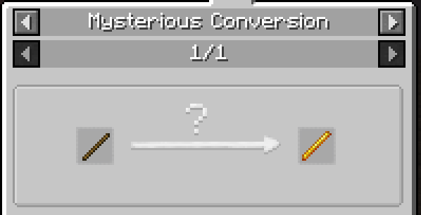

**Compacting** 1.16.5:✔️ 1.18.2:✔️ 1.19.2:✔️ 1.20.1:✔️ 1.21.1:✔️️

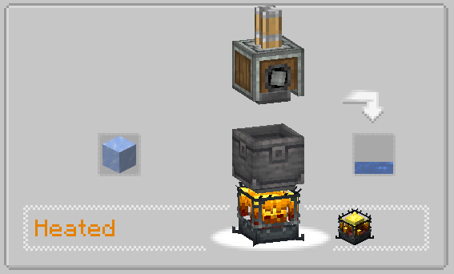

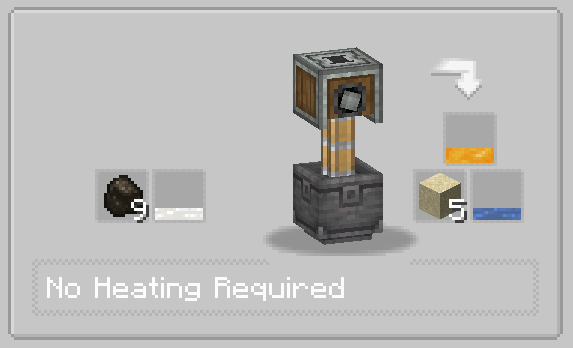

**Mixing** 1.16.5:✔️ 1.18.2:✔️ 1.19.2:✔️ 1.20.1:✔️ 1.21.1:✔️️

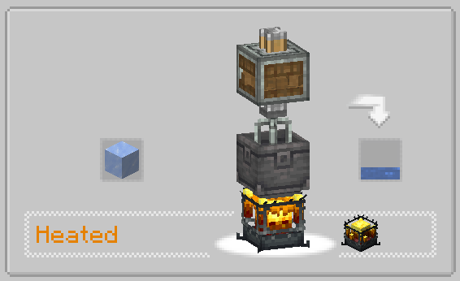

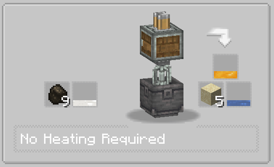

**Cutting** 1.16.5:✔️ 1.18.2:✔️ 1.19.2:✔️ 1.20.1:✔️ 1.21.1:✔️️

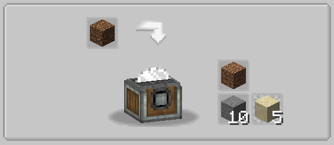

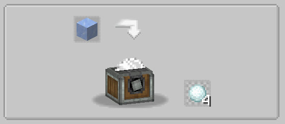

**Filling** 1.16.5:✔️ 1.18.2:✔️ 1.19.2:✔️ 1.20.1:✔️ 1.21.1:✔️️

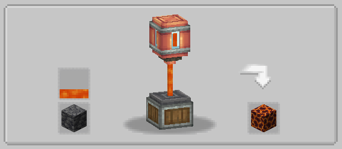

**Emptying** 1.16.5:✔️ 1.18.2:✔️ 1.19.2:✔️ 1.20.1:✔️ 1.21.1:✔️️

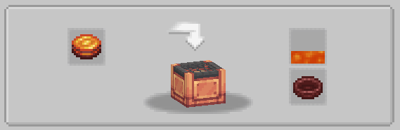

**Deploying** 1.16.5:✔️ 1.18.2:✔️ 1.19.2:✔️ 1.20.1:✔️ 1.21.1:✔️️

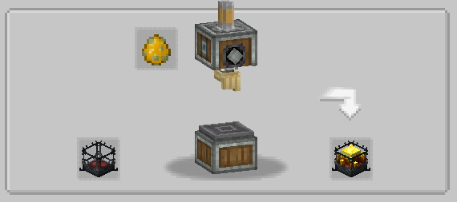

**Haunting** 1.16.5:✔️ 1.18.2:✔️ 1.19.2:✔️ 1.20.1:✔️ 1.21.1:✔️️

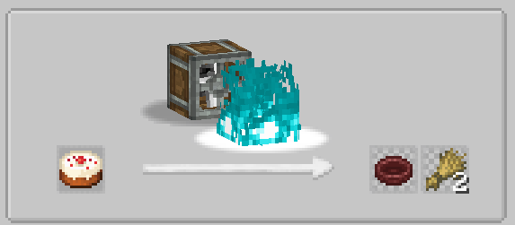

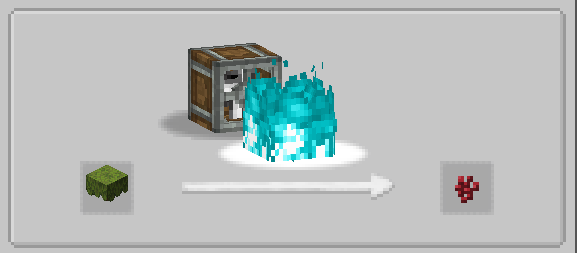

**Splashing** 1.16.5:✔️ 1.18.2:✔️ 1.19.2:✔️ 1.20.1:✔️ 1.21.1:✔️️

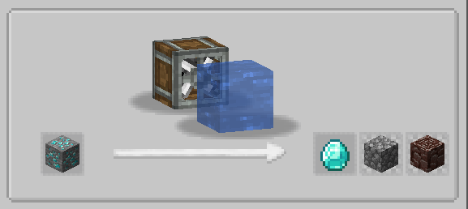

**Milling** 1.16.5:✔️ 1.18.2:✔️ 1.19.2:✔️ 1.20.1:✔️ 1.21.1:✔️️

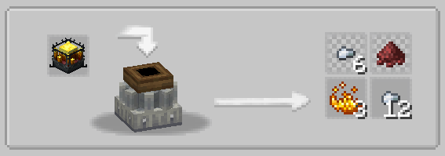

**Crushing** 1.16.5:✔️ 1.18.2:✔️ 1.19.2:✔️ 1.20.1:✔️ 1.21.1:✔️️

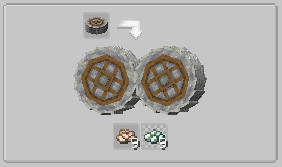
